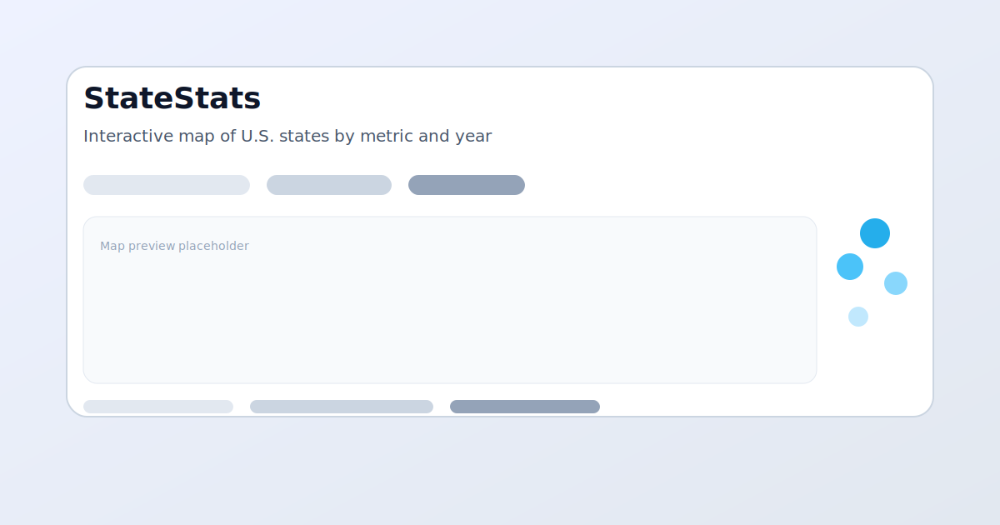

# StateStats

StateStats is a Next.js (App Router) + Prisma project for exploring U.S. state-level metrics. It ships with a typed domain model, a Supabase/PostgreSQL schema, ingestion pipelines, and interactive map/graph experiences.



## Tech stack
- Next.js (App Router) + TypeScript
- Tailwind CSS
- Prisma 6.19.0 + Supabase Postgres
- Recharts for line charts
- d3-geo + topojson-client for the choropleth map

## Prerequisites

- Node.js 18.17+ (20+ recommended)
- pnpm
- PostgreSQL with a `DATABASE_URL` connection string

## Setup

```bash
pnpm install
cp .env.example .env      # configure DATABASE_URL
pnpm db:migrate           # creates tables
pnpm db:generate          # generates the Prisma client
```

### Ingestion

- CLI: `pnpm ingest:median-income` (or `pnpm ingest:all`)
- API: `POST /api/admin/ingest` to trigger ingestion from the server runtime

The ingestion run is recorded in the `IngestionRun` table with basic counts and errors.

## Pages
- `/` Map: Choropleth by metric + year, legend, tooltip, pinned state, accessible table.
- `/graph` Compare: Multi-state line chart over time with metric selector, year range, normalization.
- `/data-sources` Provenance: Data sources, last successful ingestions, metrics catalog.
- `/about` Overview, usage tips, caveats.

## Getting started
```bash
git clone <repo-url>
cd StateStats
pnpm install
cp .env.example .env   # set DATABASE_URL (Supabase)
pnpm db:migrate
pnpm db:generate
pnpm ingest:median-income
pnpm dev
```
Open http://localhost:3000 to view the app.

## Project structure

- `app/` – App Router pages + API routes (admin ingestion, graph data)
- `components/` – Map and graph UI components
- `lib/` – shared types, Prisma client helper, state list, and metric definitions
- `prisma/schema.prisma` – PostgreSQL schema and enums
- `scripts/ingestMedianHouseholdIncome.ts` – example ingestion pipeline (mocked ACS calls)

## Useful scripts

- `pnpm dev` – run Next.js locally
- `pnpm lint` – Next.js lint
- `pnpm db:migrate` / `pnpm db:generate` – Prisma tooling
- `pnpm ingest:median-income` – run the median household income importer

## Deployment (Vercel)
- Ensure `DATABASE_URL` is set in Vercel project settings (server-side).
- Run `pnpm build` locally to verify.
- Deploy via Vercel (Git integration or `vercel` CLI). The app uses App Router defaults; no special vercel.json required.

## Data model & ingestion
- Core tables: State, Metric, Observation, DataSource, IngestionRun.
- Ingestion pipeline seeds states, data source, metric (median household income), and synthetic observations for development.
- Latest successful ingestion is surfaced in the global banner and Data Sources page.
